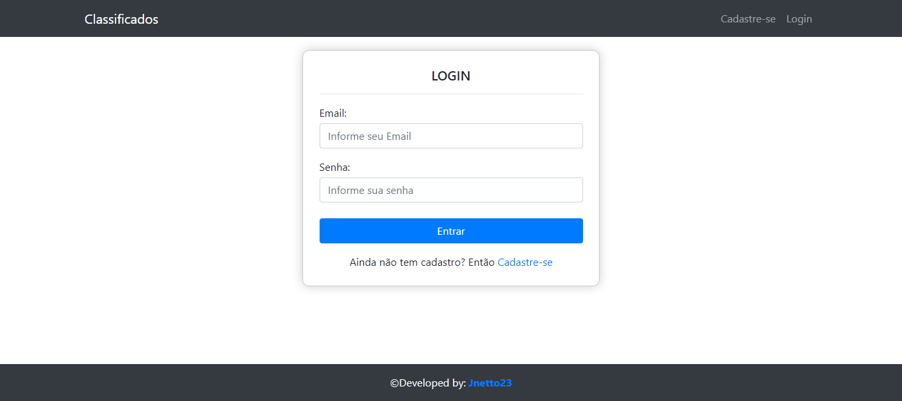
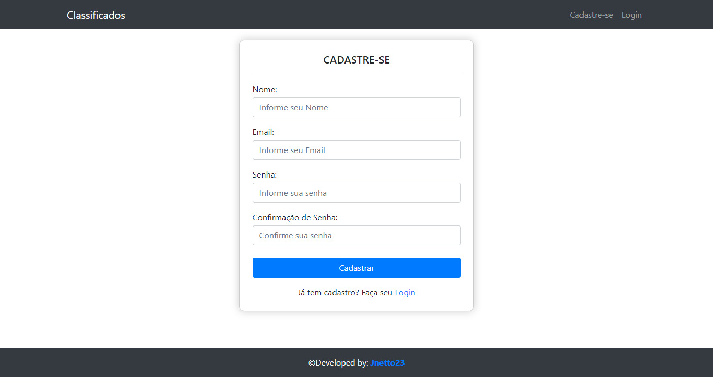
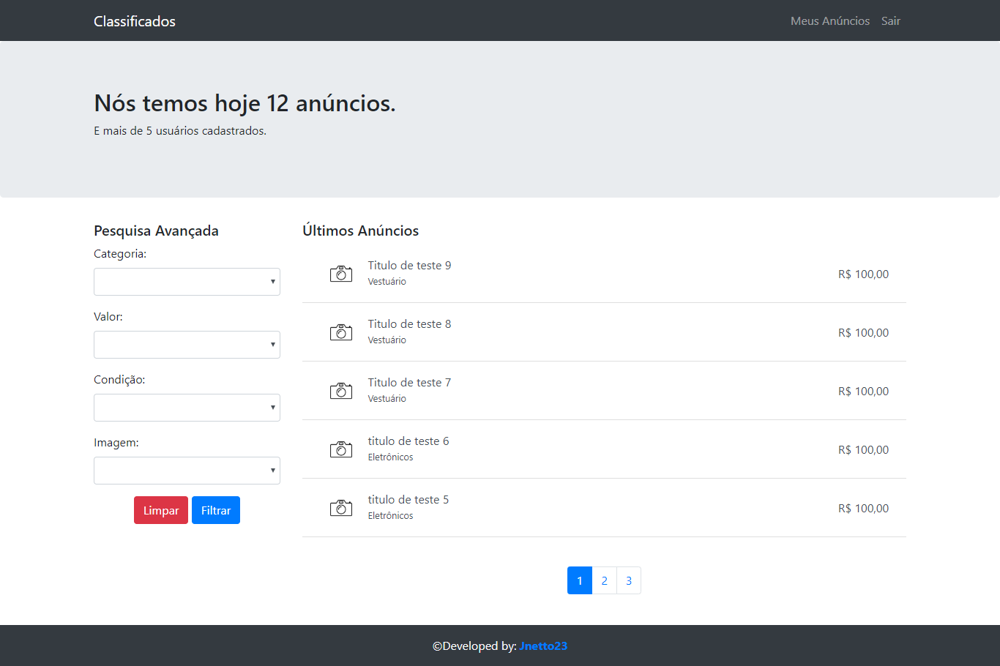
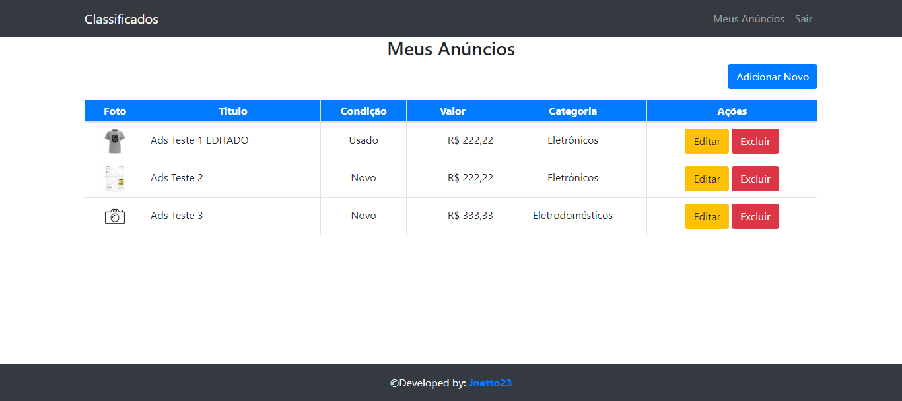
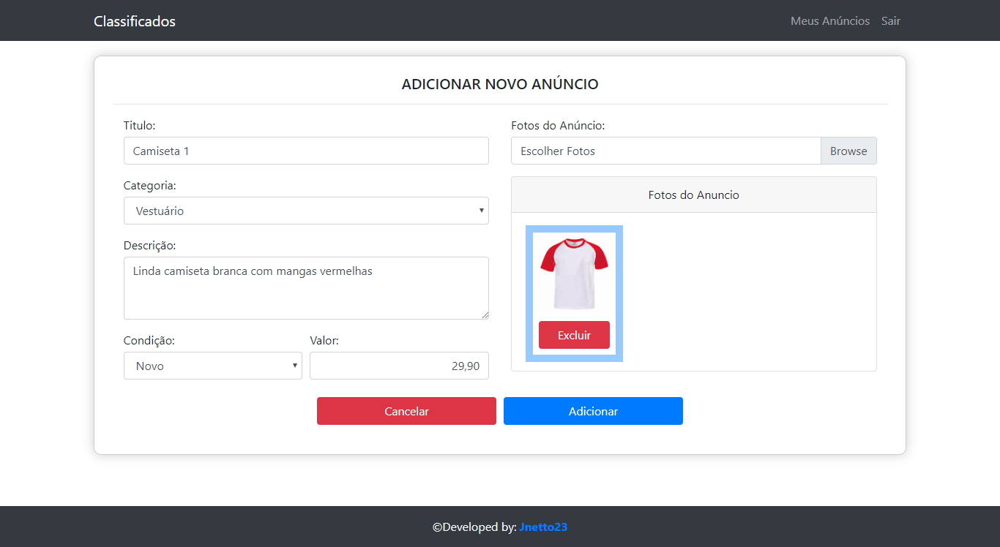
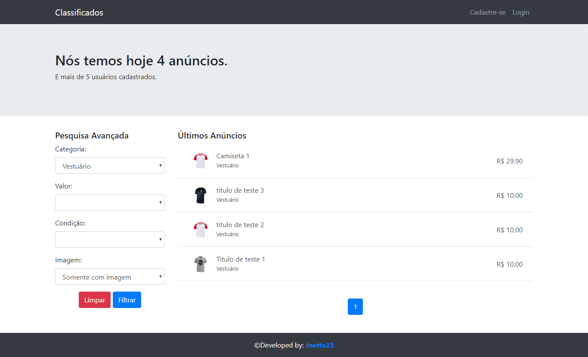
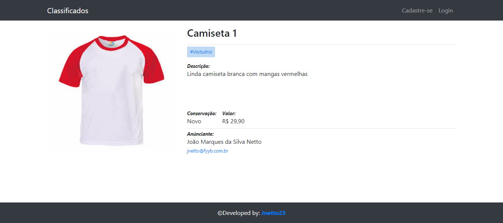

# Simple Ads Site

  
## Objective/Challenge

Create backend/frontend of the a simple ads/classified system.

## Stack Used

- Backend:
  - PHP7
  - MySQL
- Frontend:
  - HTML - Use of semantic tags;
  - CSS3 - Mobile first standard, use of Flexbox and media queries;
  - JavaScript

## Screenshots

### Pages
<table>
      <tr>
        <td style="text-align: center; vertical-align: baseline;">
          <h4 style="text-transform: uppercase;">Signin</h4>
          
        </td>
        <td style="text-align: center; vertical-align: baseline;">
          <h4 style="text-transform: uppercase;">Signup</h4>
          
        </td>
      </tr>
      <tr>
        <td style="text-align: center; vertical-align: baseline;">
          <h4 style="text-transform: uppercase;">Home (logged)</h4>
          
        </td>
        <td style="text-align: center; vertical-align: baseline;">
          <h4 style="text-transform: uppercase;">My Ads</h4>
          
        </td>
      </tr>
      <tr>
        <td style="text-align: center; vertical-align: baseline;">
          <h4 style="text-transform: uppercase;">New</h4>
          
        </td>
        <td style="text-align: center; vertical-align: baseline;">
          <h4 style="text-transform: uppercase;">Edit</h4>
          
        </td>
      </tr>
      <tr>
        <td style="text-align: center; vertical-align: baseline;">
          <h4 style="text-transform: uppercase;">Home with filter</h4>
          
        </td>
        <td style="text-align: center; vertical-align: baseline;">
          <h4 style="text-transform: uppercase;">Ads</h4>
          
        </td>
      </tr>
    </table>
